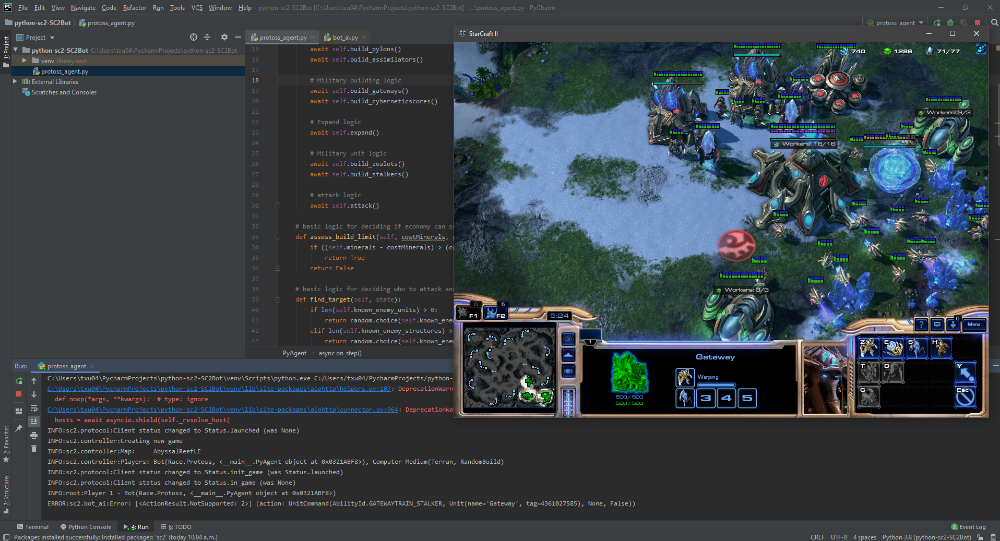

# Python-SC2
## Play against a native Blizzard AIs Via Python-SC2 lib by connecting with Starcraft 2 API

Using Dentosal's [A StarCraft II API Client for Python 3](https://github.com/Dentosal/python-sc2) mostly as a learning oppertunity before using the more complex lib of deepmind's [PySC2 - StarCraft II Learning Environment](https://github.com/deepmind/pysc2) 

Protoss agent currently gather resources, expand and rush the enemy with constant waves of basic units after setting up a formidable economy

## Prerequisites

### Get Python-SC2

Easiest way is to use pip

```
$ pip install pysc2
```

More information in [A StarCraft II API Client for Python 3](https://github.com/Dentosal/python-sc2) 

### Video Preview of the Agent in Action
[](http://www.youtube.com/watch?v=tXFtvvcM7WU "Python-SC2 - StarCraft II bot api client library for Python 3 VS. Medium Bot")

(Originally based on online tutorial of [sentdex](https://www.youtube.com/channel/UCfzlCWGWYyIQ0aLC5w48gBQ))

...



Currently not much machine learning yet :(

Experimenting with all races and executing different builds to get familiar with PySC2 :)
